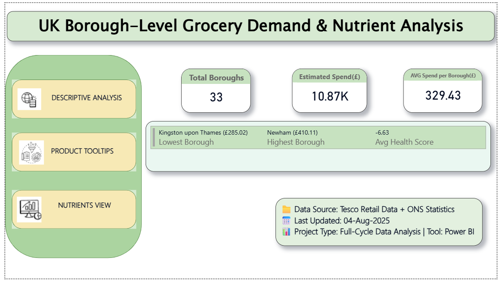
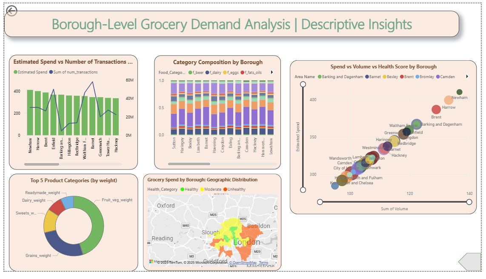
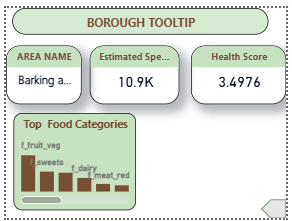
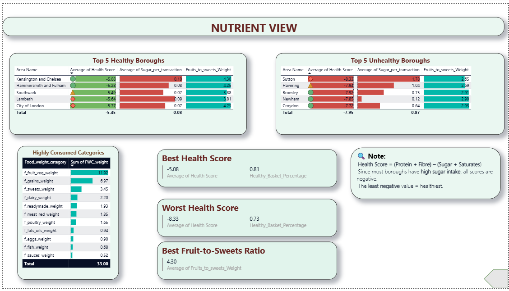

UK Borough Grocery Demand Analysis

📊 **Full-Cycle Data Analytics Project** using **Excel, SQL, and Power BI**.  
This project analyses grocery demand patterns across UK boroughs and demonstrates **Descriptive, Diagnostic, Prescriptive, and Predictive** analytics.

---

🚀 Project Workflow
1. **Data Cleaning (Excel)** – handled missing values, formatting, and created reference tables.  
2. **Descriptive Analysis (Power BI)** – borough-level demand trends, KPIs, and visuals.  
3. **Diagnostic Analysis (SQL)** – queries to uncover demand drivers and anomalies.  
4. **Prescriptive Analysis** – insights & recommendations for inventory optimisation.  
5. **Predictive Analysis (PowerBI/Excel)** – forecasting demand trends.  
6. **Final Deliverables** – dashboard, slides, and written report.

---

📂 Repository Structure
```
.
├─ Dataset/
│  ├─ mainreferencetables.xlsx
│  └─ year_borough_grocery.xlsx
├─ PowerBI/
│  ├─ Borough_Demand.pbix           # tracked with Git LFS if >100MB
│  └─ Dashboard_Screenshots/
│      ├─ overview.png
│      └─ borough_trends.png
├─ SQL/
│  └─ diagnostic_queries.sql
├─ Excel/
│  ├─ cleaning_steps.xlsx
│  └─ analysis_notes.xlsx
└─ Reports/
   ├─ Project_Report.docx
   ├─ Project_Report.pdf
   └─ Presentation_Slides.pdf
```

📸 Dashboard Preview

  
  
  



---

🧠 Key Questions Answered
- Which boroughs have the highest/lowest per‑capita grocery demand?
- How has demand changed across years and categories?
- What drivers (price, seasonality, income proxies) correlate with demand?
- What actions should a retailer take next (stocking, promotions, store ops)?

---

🛠 Tools Used
- **Excel** – Data cleaning & preparation  
- **SQL** – Diagnostic queries & root‑cause analysis  
- **Power BI** – Dashboards, KPIs, and forecasting  
- **MS Word** – Detailed analytical report  
- **Google Slides/PowerPoint** – Executive summary  

---

📑 Reports
- [📄 Full Report (PDF)](Reports/Project_Report.pdf)  
- [🎯 Presentation Slides] (Google Slides Link)](https://docs.google.com/presentation/d/1BX4ICy.../edit?usp=sharing)

---

## 👤 Author
Venkatesh Sridhar  
📧 venkateshlak99@hotmail.com  
🔗 [LinkedIn](https://linkedin.com/in/YOUR_HANDLE)

